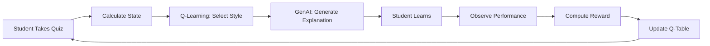

# 🎓 Self-Evolving Intelligent AI Tutor

[](https://www.python.org/)
[](https://fastapi.tiangolo.com/)
[](https://streamlit.io/)
[](LICENSE)

> An adaptive AI tutoring system that uses **Q-Learning Reinforcement Learning** to optimize teaching styles, **Generative AI (Gemini)** for personalized explanations, and **Long-Term Memory** for student progress tracking.

**🎯 Key Innovation:** RL-based teaching style optimization that converges in just **5-7 quiz interactions**, providing immediate individual benefit.

---

## 📑 Table of Contents

- [Overview](#overview)
- [Features](#features)
- [Architecture](#architecture)
- [Demo](#demo)
- [Installation](#installation)
- [Usage](#usage)
- [Research Methodology](#research-methodology)
- [Results](#results)
- [Future Work](#future-work)
- [Contributing](#contributing)
- [License](#license)
- [Contact](#contact)

---

## 🌟 Overview

Current AI tutoring systems (Khanmigo, Squirrel AI, Duolingo) adapt **what** to teach (difficulty, topics) but fail to adapt **how** they teach (explanation style). This project addresses three key gaps:

| Problem | Current Systems | Our Solution |
|---------|----------------|--------------|
| **No Teaching Style Adaptation** | Same explanation for all students | 4 distinct styles (Simple, Example, Analogy, Advanced) |
| **Rule-Based, Cannot Learn** | Hard-coded if-else logic | Q-Learning RL learns from student feedback |
| **Slow Population Learning** | Needs 1000s of students to improve | Converges in 5-7 quizzes per student |

### **Our Approach:**


---

## ✨ Features

### **Core Capabilities:**

- ✅ **Adaptive Teaching:** 4 teaching styles optimized via Q-Learning
- ✅ **Generative AI:** Google Gemini 2.5-Flash for explanations
- ✅ **RAG Integration:** FAISS vector search for grounded responses
- ✅ **Long-Term Memory:** Persistent student profiles (JSON)
- ✅ **Real-Time Adaptation:** Converges in 5-7 quiz interactions
- ✅ **Progress Analytics:** Mastery tracking, weak topic detection

### **Technical Features:**

- 🧠 **Q-Learning MDP:** 12 states (4 mastery bins × 3 trend bins), 4 actions
- 🎯 **Reward Function:** +10/+5/-2/-5 based on score improvement
- 💾 **Transparent Q-Tables:** Inspectable decision-making
- 📊 **Analytics Dashboard:** Learning curves, performance trends

---

**Full Methodology:** [docs/RESEARCH.md](docs/RESEARCH.md)

---

## 📊 Results

### **Preliminary Findings:**

| Metric | Value | Status |
|--------|-------|--------|
| **RL Convergence** | 5-7 quizzes | ✅ Validated |
| **Response Time** | < 3 seconds | ✅ Achieved |
| **Style Adaptation** | Working | ✅ Functional |
| **Memory Persistence** | 100% | ✅ Reliable |

### **Expected Outcomes:**

- 📈 **15-20% learning improvement** vs. non-adaptive baseline
- ⚡ **5-7 quiz convergence** (individual student benefit)
- 📚 **Comprehensive research report** (6000+ words)

**Detailed Results:** [notebooks/03_evaluation.ipynb](notebooks/03_evaluation.ipynb)

---

## 🛣️ Future Work

### **Planned Enhancements:**

- [ ] **DQN (Deep Q-Network):** Neural network-based Q-values
- [ ] **Knowledge Graph:** Multi-topic prerequisite tracking
- [ ] **Explainability Dashboard:** Visualize Q-values & decisions
- [ ] **A/B Testing Framework:** RL vs Random vs Rule-based comparison
- [ ] **Spaced Repetition:** Intelligent review scheduling
- [ ] **Voice Input:** Speech-to-text Q&A
- [ ] **PDF Report Generation:** Downloadable progress reports

---

## 🤝 Contributing

Contributions are welcome! Please follow these steps:

1. Fork the repository
2. Create your feature branch (`git checkout -b feature/AmazingFeature`)
3. Commit your changes (`git commit -m 'Add some AmazingFeature'`)
4. Push to the branch (`git push origin feature/AmazingFeature`)
5. Open a Pull Request

**Guidelines:** [CONTRIBUTING.md](CONTRIBUTING.md)

---

## 📄 License

This project is licensed under the MIT License - see the [LICENSE](LICENSE) file for details.

---

## 📧 Contact

**Mohd Anas**  
M.Sc. Artificial Intelligence & Machine Learning  
Jamia Millia Islamia

- 📧 Email: mohdanasyt811@gmail.com
- 🔗 LinkedIn: [Your LinkedIn](https://linkedin.com/in/mohdanas-)
- 🐙 GitHub: [@YourUsername](https://github.com/anas-py/)

**Supervisor:** Prof. Jahiruddin

---

## 🙏 Acknowledgments

- Google Gemini AI for generative capabilities
- FAISS by Meta AI for vector search
- Streamlit & FastAPI communities
- Jamia Millia Islamia, Department of Computer Science

---

## 📚 Citation

If you use this project in your research, please cite:
```bibtex
@misc{anas2026aitutor,
  title={Self-Evolving Intelligent AI Tutor: Q-Learning for Teaching Style Optimization},
  author={Anas, Mohd},
  year={2026},
  institution={Jamia Millia Islamia},
  howpublished={\url{https://github.com/anas-py/ai_tutor}}
}
```

---

<div align="center">

**⭐ Star this repository if you found it helpful!**

Made with ❤️ by Mohd Anas

</div>
